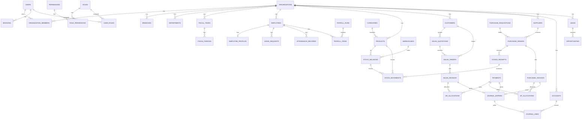

# 5–8. Database architecture, ERD, tables, relationships

## 5. Database architecture

### Source of truth

**One PostgreSQL 16 cluster** (primary). Optional read replica from Phase 9 for reports.

Physical isolation **today:** PostgreSQL **schemas** per bounded context.  
Logical isolation: `organization_id` + RLS.

When a module is extracted, its schema becomes its own database. Until then, **cross-schema foreign keys are allowed** for strong consistency (e.g. `purchase.goods_receipt_lines.product_id → inventory.products.id`).

### Why schemas, not “all public”

| | |
| --- | --- |
| **Why** | Makes ownership visible; `GRANT` can lock down later; Prisma `@@schema` maps 1:1 to Nest modules. |
| **Problem solved** | Accidental joins and “just add a column on products from sales”. |
| **Trade-off** | Slightly more Prisma config; migrations must be ordered. |
| **Scale** | Schemas do not improve performance by themselves. Indexes and partitioning do. |
| **Change later** | `pg_dump --schema=finance` is the extraction unit. |

### Cross-cutting physical objects (schema `platform`)

| Table | Role |
| --- | --- |
| `outbox_events` | Written in the **same TX** as business rows; publisher pushes to RabbitMQ |
| `inbox_messages` | Consumer idempotency (`message_id` unique) |
| `idempotency_keys` | HTTP idempotency for payments/posting |
| `audit_logs` | Append-only (see security doc) |
| `file_objects` | MinIO key metadata |

### Rules applied to every tenant-owned table

- PK `id UUID` (UUID v7)
- `organization_id UUID NOT NULL` → `organization.organizations(id)`
- `created_at`, `updated_at` `timestamptz NOT NULL`
- `deleted_at timestamptz` where the entity is soft-deletable (masters yes; journals **no**)
- `created_by`, `updated_by` UUID NULL (system jobs)
- Unique constraints **always include** `organization_id` unless the column is globally unique (user email)
- Check constraints for money (`amount >= 0` where applicable), quantities, status enums
- Partial indexes `WHERE deleted_at IS NULL`

### Optimistic locking

`version INT NOT NULL DEFAULT 1` on:

- `inventory.stock_balances`
- commercial documents that can be concurrently edited while `draft`
- `finance.accounts` balances if we denormalize (we will **not** denormalize GL balances initially)

On conflict: HTTP 409 `COMMON.VERSION_CONFLICT`.

### Partitioning (later, not Phase 1)

Partition by month when large:

- `platform.audit_logs`
- `platform.outbox_events` (after publish + retention)
- `inventory.stock_movements`
- `finance.journal_entries` / `journal_lines`

### What we will **not** do

- Store balances only in Redis
- Use JSON for journal lines as the primary model
- UUID v4 as the default (v7 preferred)
- Natural string PKs (`INV-001`) as PK — those are **document numbers**, unique per tenant, not PKs

---

## 6. Complete ERD (logical)

Masters and transactions. Enums shown as Status.

---

## 7. Database table definitions

Conventions: `TEXT` for enums in Prisma mapped to Postgres enums **or** `TEXT + CHECK`. We use **PostgreSQL enums** for closed sets (document status) and `TEXT` for extensible tax codes.

Money: `NUMERIC(19,4)`. Quantity: `NUMERIC(18,6)`. Currency: `CHAR(3)` ISO 4217.

### identity

**users**  
`id`, `email` UNIQUE, `password_hash`, `name`, `is_active`, `email_verified_at`, `totp_enabled`, `created_at`, `updated_at`, `deleted_at`  
Platform-level person. Not tenant-owned.

**user_totp**  
`user_id` PK/FK, `secret_encrypted`, `verified_at`, `backup_codes_hashed[]` equivalent table `user_totp_backup_codes`

**sessions**  
`id`, `user_id`, `family_id`, `refresh_token_hash` UNIQUE, `replaced_by_session_id`, `expires_at`, `revoked_at`, `user_agent`, `ip`, `last_used_at`  
Refresh **rotation**: reuse of a revoked token in the same family revokes the **entire family**.

**login_attempts**  
`id`, `email`, `ip`, `success`, `created_at` — rate-limit / lockout analytics

**permissions**  
`id`, `code` UNIQUE (`sales.invoices.post`), `resource`, `action`, `description`

**roles**  
`id`, `organization_id` NULL (system template) or tenant, `code`, `name`, `is_system`

**role_permissions**  
`(role_id, permission_id)` PK

**user_roles**  
`id`, `user_id`, `role_id`, `organization_id`, `branch_id` NULL  
UNIQUE `(user_id, role_id, organization_id, COALESCE(branch_id, zero uuid))`

### organization

**organizations**  
`id`, `slug` UNIQUE, `name`, `status` (`trial|active|suspended|closed`), `base_currency`, `timezone`, `created_at`, `updated_at`

**organization_members**  
`id`, `organization_id`, `user_id`, `status` (`invited|active|disabled`), `joined_at`  
UNIQUE `(organization_id, user_id)`

**branches**  
`id`, `organization_id`, `code`, `name`, `address_json`, `is_active`  
UNIQUE `(organization_id, code)`

**departments**  
`id`, `organization_id`, `branch_id` NULL, `code`, `name`, `parent_id` NULL

**designations**  
`id`, `organization_id`, `code`, `name`

**fiscal_years**  
`id`, `organization_id`, `name`, `starts_on`, `ends_on`, `status` (`open|closed`)  
EXCLUDE overlapping years per org (constraint via check + app validation; PG exclusion optional later)

**fiscal_periods**  
`id`, `fiscal_year_id`, `organization_id`, `name`, `starts_on`, `ends_on`, `status`

**business_settings**  
`organization_id` PK, `invoice_prefix`, `quote_prefix`, `inventory_negative_allowed` BOOLEAN DEFAULT false, `settings_json` for non-critical flags

### hr

**employees**  
`id`, `organization_id`, `employee_no` UNIQUE per org, `user_id` NULL, `branch_id`, `department_id`, `designation_id`, `first_name`, `last_name`, `status` (`active|on_leave|terminated`), `joined_on`, `terminated_on`, `deleted_at`

**employee_profiles**  
`employee_id` PK, extra personal JSON + normalized fields (`dob`, `gender`, `national_id_encrypted`)

**holidays**  
`id`, `organization_id`, `date`, `name`, `branch_id` NULL

**leave_types**  
`id`, `organization_id`, `code`, `name`, `paid`, `max_days`

**leave_balances**  
`(employee_id, leave_type_id, fiscal_year_id)`, `allocated`, `used`, `version`

**leave_requests**  
`id`, `employee_id`, `leave_type_id`, `from_date`, `to_date`, `days`, `status` (`draft|submitted|approved|rejected|cancelled`), `approver_id`

**attendance_records**  
`id`, `employee_id`, `work_date`, `check_in_at`, `check_out_at`, `source` (`manual|device|import`)  
UNIQUE `(employee_id, work_date)` for one-row-per-day model (refine if multiple shifts)

**salary_structures**  
`id`, `organization_id`, `name`, `effective_from`

**salary_components**  
`id`, `salary_structure_id`, `code`, `name`, `type` (`earning|deduction`), `calc` (`fixed|percent`)

**employee_salary**  
`employee_id`, `salary_structure_id`, `effective_from`, `gross`, `currency`

**payroll_runs**  
`id`, `organization_id`, `period_id`, `status` (`draft|processing|confirmed|posted|void`), `totals`

**payroll_items**  
`id`, `payroll_run_id`, `employee_id`, `gross`, `deductions`, `net`, `breakdown_json`

**employee_documents**  
`id`, `employee_id`, `file_object_id`, `type`, `issued_on`

### inventory

**categories**  
`id`, `organization_id`, `parent_id`, `name`, `code`

**brands**  
`id`, `organization_id`, `name`

**units**  
`id`, `organization_id`, `code` (`PCS`, `KG`), `name`

**products**  
`id`, `organization_id`, `sku` UNIQUE per org, `name`, `category_id`, `brand_id`, `base_unit_id`, `type` (`stocked|service|non_stock`), `is_active`, `cost_method` (`weighted_average` default), `deleted_at`

**product_barcodes** optional later

**warehouses**  
`id`, `organization_id`, `branch_id` NULL, `code`, `name`, `is_active`

**stock_balances**  
`id`, `organization_id`, `product_id`, `warehouse_id`, `qty_on_hand`, `qty_reserved`, `qty_available` GENERATED (`on_hand - reserved`) **or** maintained in app + CHECK `qty_reserved >= 0 AND qty_on_hand >= 0`  
UNIQUE `(product_id, warehouse_id)`  
`version` for optimistic lock  
CHECK `qty_on_hand >= qty_reserved` unless settings allow negatives (still never allow reserved > on_hand)

**stock_movements** (immutable)  
`id`, `organization_id`, `product_id`, `warehouse_id`, `type` (`receipt|issue|reserve|release|transfer_in|transfer_out|adjust_in|adjust_out`), `qty` (signed or always positive with direction — **positive + type**), `unit_cost`, `source_type`, `source_id`, `occurred_at`, `correlation_id`  
No `deleted_at`. No updates except forbidden.

**stock_adjustments**  
header: `status`, `reason`, `posted_at`  
**stock_adjustment_lines** — product, warehouse, qty, direction

**stock_transfers**  
`from_warehouse_id`, `to_warehouse_id`, `status` (`draft|in_transit|completed|cancelled`)  
**stock_transfer_lines**

### sales

**customers**  
`id`, `organization_id`, `code`, `name`, `tax_id`, `credit_limit`, `receivable_account_id` NULL (default from settings), `deleted_at`  
UNIQUE `(organization_id, code)`

**sales_quotations**  
`id`, `organization_id`, `number`, `customer_id`, `status` (`draft|sent|accepted|expired|cancelled`), `valid_until`, currency, fx, totals  
**sales_quotation_lines** — product_id NULL for free text, qty, unit_price, discount, tax_code, line_total

**sales_orders**  
`id`, `number`, `customer_id`, `quotation_id` NULL, `warehouse_id`, `status` (`draft|confirmed|partially_fulfilled|fulfilled|cancelled`), `confirmed_at`  
**sales_order_lines** — `qty_ordered`, `qty_reserved`, `qty_shipped`, `qty_invoiced`

**shipments**  
`id`, `sales_order_id`, `warehouse_id`, `status` (`draft|posted|cancelled`)  
**shipment_lines** — `order_line_id`, `qty`

**sales_invoices**  
`id`, `number`, `customer_id`, `sales_order_id` NULL, `status` (`draft|posted|void|reversed`), `invoice_date`, `due_date`, `subtotal`, `tax_total`, `grand_total`, `amount_paid`, `journal_entry_id` NULL  
**sales_invoice_lines**

**sales_returns**  
against invoice/shipment; posts credit note + stock receipt.

### purchase

**suppliers**  
mirror of customers (code, name, tax_id, payable_account_id)

**purchase_requisitions**  
`status` (`draft|submitted|approved|rejected|converted`)  
**pr_lines**

**purchase_orders**  
`supplier_id`, `pr_id` NULL, `status` (`draft|approved|sent|partially_received|received|closed|cancelled`)  
**po_lines** — `qty_ordered`, `qty_received`, `qty_invoiced`

**goods_receipts**  
`purchase_order_id`, `warehouse_id`, `status` (`draft|posted|cancelled`)  
**grn_lines**

**purchase_invoices**  
AP bills; `status` draft/posted/void; `journal_entry_id`

**purchase_returns**

### finance

**accounts**  
`id`, `organization_id`, `code` UNIQUE per org, `name`, `type` (`asset|liability|equity|revenue|expense`), `subtype` (cash, ar, ap, inventory, cogs, tax, …), `parent_id`, `is_postable`, `currency` NULL (tenant default), `is_system`

**tax_codes**  
`id`, `organization_id`, `code`, `name`, `rate`, `payable_account_id`, `receivable_account_id`

**journal_entries** (immutable once posted)  
`id`, `organization_id`, `number`, `entry_date`, `period_id`, `status` (`draft|posted|reversed`), `source_type`, `source_id`, `reversal_of_id` NULL, `memo`, `posted_at`, `posted_by`  
CHECK: posted entries never updated (enforced with trigger `PREVENT_POSTED_JOURNAL_MUTATION`)

**journal_lines**  
`id`, `journal_entry_id`, `account_id`, `debit` NUMERIC(19,4) DEFAULT 0, `credit` NUMERIC(19,4) DEFAULT 0, `cost_center_id` NULL, `party_type`, `party_id`, `memo`  
CHECK `(debit = 0 AND credit > 0) OR (credit = 0 AND debit > 0)`  
CHECK sum(debit)=sum(credit) on the entry via **deferred constraint trigger** or application + lock

**payments**  
`id`, `organization_id`, `direction` (`inbound|outbound`), `party_type` (`customer|supplier|employee|other`), `party_id`, `method` (`cash|bank|other`), `bank_account_id` NULL, `amount`, `currency`, `status` (`draft|posted|void`), `journal_entry_id`, `received_at`

**payment_allocations**  
`payment_id`, `document_type` (`sales_invoice|purchase_invoice`), `document_id`, `amount`

**bank_accounts**  
`id`, `organization_id`, `account_id` (GL cash/bank), `name`, `iban`

### crm

**leads** — org, name, email, phone, source, status, owner_user_id  
**opportunities** — lead_id, customer_id NULL, amount, stage, expected_close  
**activities** — type (call/email/meeting/task), related_type/id, due_at, completed_at  
**follow_ups** — activity or opportunity scheduler

### notification

**notification_templates** — `code`, `channel` (`email|in_app`), locale, subject, body  
**in_app_notifications** — user_id, org_id, title, body, read_at, event_id  
**email_messages** — to, template, payload, status, provider_id

### platform

**outbox_events**  
`id`, `organization_id`, `aggregate_type`, `aggregate_id`, `event_type`, `event_version`, `payload_jsonb`, `correlation_id`, `causation_id`, `created_at`, `published_at` NULL, `publish_attempts`

**inbox_messages**  
`id` (event id from broker), `consumer_name`, `processed_at`  
PK `(id, consumer_name)`

**idempotency_keys**  
`organization_id`, `actor_id`, `key`, `request_hash`, `response_json`, `status`, `created_at`  
UNIQUE `(organization_id, key)`

### Indexes (minimum)

| Table | Index |
| --- | --- |
| All tenant tables | `(organization_id)` |
| `products` | unique `(organization_id, sku)` WHERE deleted_at IS NULL |
| `stock_balances` | unique `(product_id, warehouse_id)` |
| `stock_movements` | `(organization_id, product_id, warehouse_id, occurred_at DESC)` |
| `journal_entries` | `(organization_id, entry_date)`, unique `(organization_id, number)` |
| `journal_lines` | `(account_id, journal_entry_id)` |
| `sales_invoices` | `(organization_id, status, invoice_date)`, unique number |
| `customers` | `(organization_id, name)` + `pg_trgm` on name |
| `sessions` | `(user_id)`, unique `refresh_token_hash` |
| `audit_logs` | `(organization_id, created_at DESC)`, `(entity, entity_id)` |
| `outbox_events` | `(published_at NULLS FIRST, created_at)` partial where unpublished |
| `user_roles` | `(organization_id, user_id)` |

---

## 8. Entity relationships — cardinality highlights

| From | To | Type | Rule |
| --- | --- | --- | --- |
| User | Organization | M:N via members | JWT picks **one** current org |
| Product | StockBalance | 1:N (per warehouse) | Created lazily on first movement |
| SalesOrderLine | StockMovement (reserve) | 1:N | Reservation qty ≤ ordered − shipped |
| GoodsReceipt posted | StockMovement receipt | 1:N | Same TX as GRN post |
| SalesInvoice posted | JournalEntry | 1:1 | Invoice cannot post twice (`journal_entry_id` unique where not null) |
| Payment | Invoices | M:N allocations | SUM(alloc) ≤ payment.amount; alloc ≤ invoice open balance |
| JournalEntry | JournalLine | 1:N (≥2) | Debits = credits; ≥1 debit and ≥1 credit |
| JournalEntry reversed | JournalEntry | 1:1 | `reversal_of_id` unique |
| Employee | User | N:1 optional | Login-capable staff |

### Document numbering

`document_sequences(organization_id, type, fiscal_year_id, last_value)` updated with `UPDATE ... RETURNING` inside the posting transaction. Format `{PREFIX}-{YEAR}-{SEQ}` unique per org.
